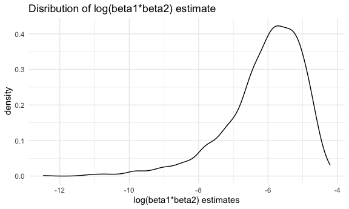
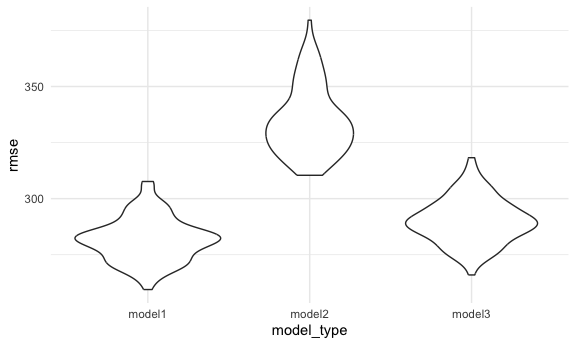

p8105_hw6_yl5214
================

\##problem 2 \#load in the dataset

``` r
weather_df = 
  rnoaa::meteo_pull_monitors(
    c("USW00094728"),
    var = c("PRCP", "TMIN", "TMAX"), 
    date_min = "2022-01-01",
    date_max = "2022-12-31") |>
  mutate(
    name = recode(id, USW00094728 = "CentralPark_NY"),
    tmin = tmin / 10,
    tmax = tmax / 10) |>
  select(name, id, everything())
```

    ## using cached file: /Users/liyi/Library/Caches/org.R-project.R/R/rnoaa/noaa_ghcnd/USW00094728.dly

    ## date created (size, mb): 2023-10-08 19:13:28.050698 (0.343)

    ## file min/max dates: 2021-01-01 / 2023-10-31

\#bootstrapping

``` r
# function of boot_sample
boot_sample = function(df) {
  
  sample_frac(df, replace = TRUE)
  
}
set.seed(1)
#draw 5000 sample and fit the model to each strap number
boot_results=
  tibble(strap_number=1:5000) |> 
  mutate(
    strap_sample = map(strap_number, \(i) boot_sample(weather_df)),
    models = map(strap_sample, \(df) lm(tmax ~ tmin + prcp, data = df)),
    results_e=map(models, broom::tidy),
    results_r=map(models, broom::glance)
  ) |> 
  unnest(results_e, results_r) |> 
  select(strap_number,term, estimate, r.squared) |> 
  group_by(term) |> 
   pivot_wider(
    names_from= term,
    values_from= estimate
  ) |> 
    mutate(
      log_beta=log(tmin*prcp)
    )

  # distribution of r2 
boot_results |> 
  ggplot(aes(x= r.squared))+
  geom_density()+
  labs(title='Distribution of r^2 estimates',
       x='r^2 estimate')
```


``` r
 # distribution of log(beta1*beta2)
boot_results |> 
  ggplot(aes(x=log_beta))+
  geom_density()+
  labs(title='Disribution of log(beta1*beta2) estimate',
       x='log(beta1*beta2) estimates')
```



``` r
# 95% confidence interval for r_squared
boot_results |> 
  summarize(
    ci_lower=quantile(r.squared, 0.025),
    ci_upper=quantile(r.squared,0.975)
  )
```

    ## # A tibble: 1 × 2
    ##   ci_lower ci_upper
    ##      <dbl>    <dbl>
    ## 1    0.889    0.941

``` r
# 95% confidence interval for log(beta1*beta2)
boot_results |> 
  drop_na(log_beta) |> 
  summarize(
    ci_lower=quantile(log_beta, 0.025),
    ci_upper=quantile(log_beta,0.975)
  )
```

    ## # A tibble: 1 × 2
    ##   ci_lower ci_upper
    ##      <dbl>    <dbl>
    ## 1    -8.98    -4.60

## interpretation:

The distribution for log(beta1 \* beta2) is concentrated within a
specific negative range of the x-axis, and peak around -6, suggesting
that the product of the regression coefficients is typically within the
range of values from -12 to -4. This is a left skewed distribution. The
values are on negative scale indicates that beta1 times beta2 are less
than 1. The distribution for R squared estimates is skewed towards
higher values and peak at 0.92, suggesting that in most bootstrap
samples, the predictors (tmin and prcp) have consistent and substantial
contribution to the variability in the response variable. This suggests
the model is a good fit.

# Problem 3

# load in dataset

``` r
birthweight=
  read_csv('data/birthweight.csv') |> 
  janitor::clean_names() |> 
  drop_na() |> 
  mutate(
    babysex = recode(babysex, "1" = "male", "2" = "female"),
    frace = recode(frace, "1" = "White", "2" = "Black", "3" = "Asian", "4" = "Puerto Rican", "8" = "Other", "9" = "Unknown"),
    mrace = recode(mrace, "1" = "White", "2" = "Black", "3" = "Asian", "4" = "Puerto Rican", "8" = "Other"),
    malform = recode(malform, "0" = "absent", "1" = "present"),
    babysex = as.factor(babysex), 
    frace = as.factor(frace), 
    malform = as.factor(malform), 
    mrace = as.factor(mrace)
  )
```

    ## Rows: 4342 Columns: 20
    ## ── Column specification ────────────────────────────────────────────────────────
    ## Delimiter: ","
    ## dbl (20): babysex, bhead, blength, bwt, delwt, fincome, frace, gaweeks, malf...
    ## 
    ## ℹ Use `spec()` to retrieve the full column specification for this data.
    ## ℹ Specify the column types or set `show_col_types = FALSE` to quiet this message.

``` r
#build model
linear_mod= lm(bwt ~ babysex + bhead + blength + delwt + gaweeks + ppbmi, data = birthweight)
summary(linear_mod)
```

    ## 
    ## Call:
    ## lm(formula = bwt ~ babysex + bhead + blength + delwt + gaweeks + 
    ##     ppbmi, data = birthweight)
    ## 
    ## Residuals:
    ##      Min       1Q   Median       3Q      Max 
    ## -1081.84  -184.43    -8.65   174.75  2517.38 
    ## 
    ## Coefficients:
    ##               Estimate Std. Error t value Pr(>|t|)    
    ## (Intercept) -6107.9418    98.2840 -62.146  < 2e-16 ***
    ## babysexmale   -31.4291     8.6894  -3.617 0.000301 ***
    ## bhead         137.4063     3.5179  39.059  < 2e-16 ***
    ## blength        78.0190     2.0672  37.741  < 2e-16 ***
    ## delwt           3.5009     0.2875  12.178  < 2e-16 ***
    ## gaweeks        13.2231     1.4890   8.881  < 2e-16 ***
    ## ppbmi         -13.8066     1.9516  -7.075 1.74e-12 ***
    ## ---
    ## Signif. codes:  0 '***' 0.001 '**' 0.01 '*' 0.05 '.' 0.1 ' ' 1
    ## 
    ## Residual standard error: 280.8 on 4335 degrees of freedom
    ## Multiple R-squared:  0.6998, Adjusted R-squared:  0.6994 
    ## F-statistic:  1684 on 6 and 4335 DF,  p-value: < 2.2e-16

``` r
birthweight_df=
  birthweight |> 
  add_predictions(linear_mod) |> 
  add_residuals(linear_mod)

# Plotting residuals against fitted values
  birthweight_df |> 
ggplot(aes(x = pred, y = resid)) + 
  geom_point() + 
  geom_hline(yintercept = 0, color = "red") +
  labs(
    x="Fitted Values",
    y="Residuals",
    title= "Model residuals against fitted values"
    )
```


\#Description of model selection: All the variables I choose is because
those factors are most relevant to birth weight. For example, babysex is
included in the model because of potential difference between male and
female infants. Baby’s head circumference and baby’s length at birth are
direct physical measurements at birth and likely strong predictors of
weight.’delwt’,‘gaweeks’, ‘ppbmi’ are maternal factors which can
influence fetal development and hence birth weight. Also, I choose the
variables because of data-driven consideration. Each predictor in this
model is statistical significance because its p-value is less than 0.05.
The adjusted R-squared is 0.6994, which support this model is a good
indication of birth weight.

\#compare the three models

``` r
cv_df=
  birthweight|> 
  crossv_mc(n=100) |> 
  mutate(
    train=map(train, as_tibble),
    test=map(test, as_tibble)
  )
```

``` r
cv_results=
  cv_df |>
  mutate(
    model1=map(train, \(df) lm(bwt ~ babysex + bhead + blength + delwt + gaweeks + ppbmi, data = df)),
    model2= map(train, \(df) lm(bwt ~ blength+ gaweeks, data=df)),
    model3= map(train, \(df) lm(bwt ~ bhead+ blength+babysex+bhead*babysex+bhead*blength+babysex*blength+bhead*babysex*blength, data=df))
  ) |> 
  mutate(
    rmse_model1 = map2_dbl(model1, test, \(mod, df) rmse(mod, df)),
    rmse_model2 = map2_dbl(model2, test, \(mod, df) rmse(mod, df)),
    rmse_model3 = map2_dbl(model3, test, \(mod, df) rmse(mod, df)),
  ) 
```

``` r
cv_results |>
  select(starts_with ('rmse')) |> 
  pivot_longer(
    everything(),
    names_to ='model_type',
    values_to ='rmse',
    names_prefix ='rmse_'
  ) |> 
  ggplot(aes(x =model_type, y=rmse))+
  geom_violin()
```



# Conclusion:

model 1, which is the model including 6 variables is the best model
because it has the smallest rmse value, indicating the model’s
predictions are closer to the actual values.
